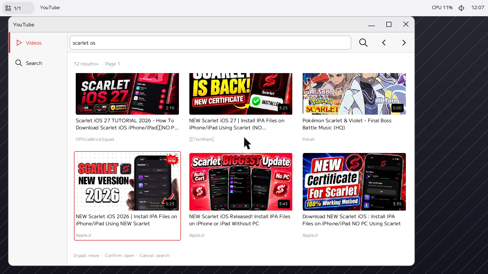
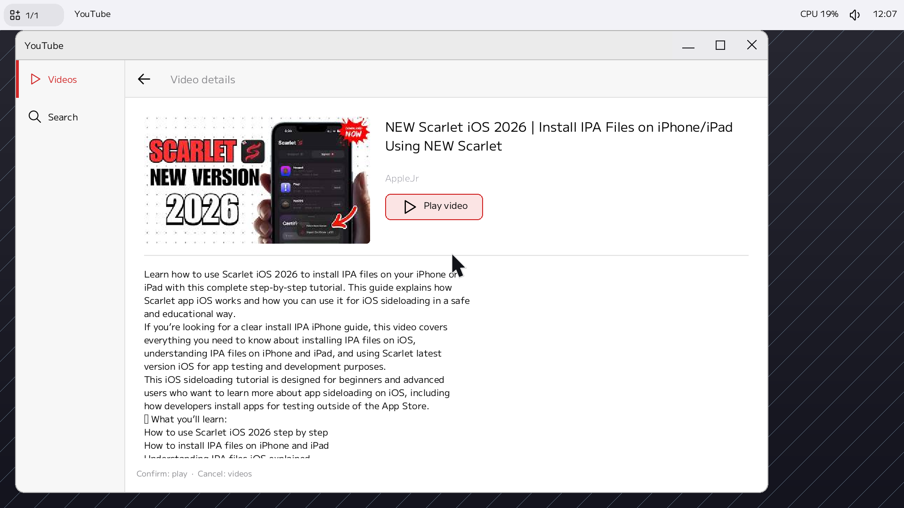
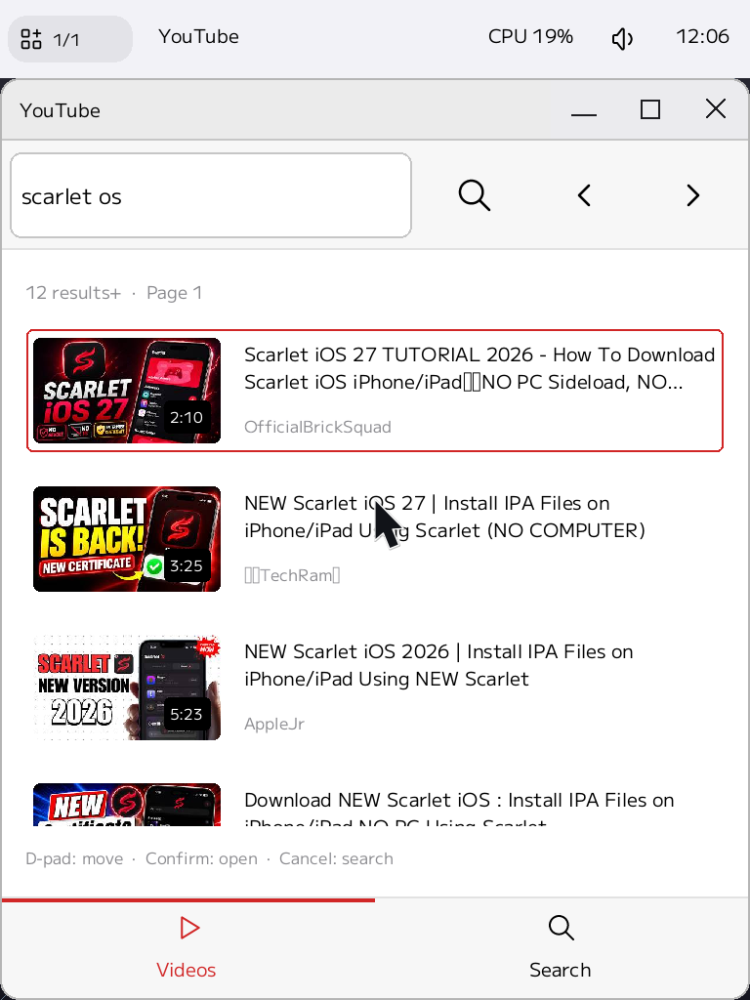

# Native GUI and controller navigation

The GUI uses ScarletUI NavigationView.header, HeaderBar, TextField, Button,
IconView, Surface, GridView, and ScrollView. Normal uses a 28px search field with
14px text; Tablet uses 44px with 16px text. Video cards contain thumbnail, title,
and channel; selecting a card opens details with its Play video action.







These are real Scarlet VM screenshots with live YouTube results, at density 2.
Search, continuation, thumbnails, details, and the existing yt/VideoPlayer stream
path are preserved. Existing system text input and the separate soft keyboard
provide search entry. Confirm/Cancel follow the configured gamepad menu mapping.

Eight host tests cover native RenderingPipeline key/TouchFrame handling,
cancellation, card/detail playback activation, held Confirm, selection/page
restoration, stale asynchronous responses, and title wrapping. The three screens
are rendered at six logical sizes, including 320×240 and portrait/landscape.
Set YT_QA_DIR to retain the rendered PPM fixtures. Run with --test-threads=1.

Release target builds passed. Live VM testing covered search → details → actual
YouTube H.264/AAC playback → pause/seek → return, and Normal/Tablet/Focused layouts.
VM key/pointer input was injected; physical gamepad/touch and end-to-end typing
through the separate soft keyboard remain unverified. Audio decode was observed,
but audible output and the GPU compositor's zero-copy path were not tested.

## Reproduce the host UI tests on macOS

From this repository with the companion Scarlet checkout at `../Scarlet`:

```sh
cargo test -p yt-gui --target aarch64-apple-darwin \
  --config 'patch."https://github.com/petitstrawberry/Scarlet".scarlet-os.path="../Scarlet/user/lib/scarlet-os"' \
  -- --test-threads=1
```

The companion Scarlet change gates its ELF IPC trampoline to Scarlet targets.
The temporary host-only patch selects that fix; production target builds use
the pinned dependencies normally. Run a target build afterward to restore any
lockfile changes caused by the host-only override.
